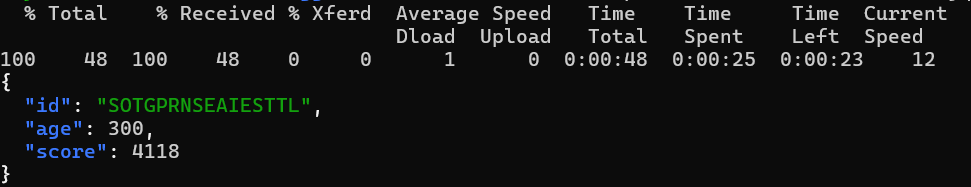
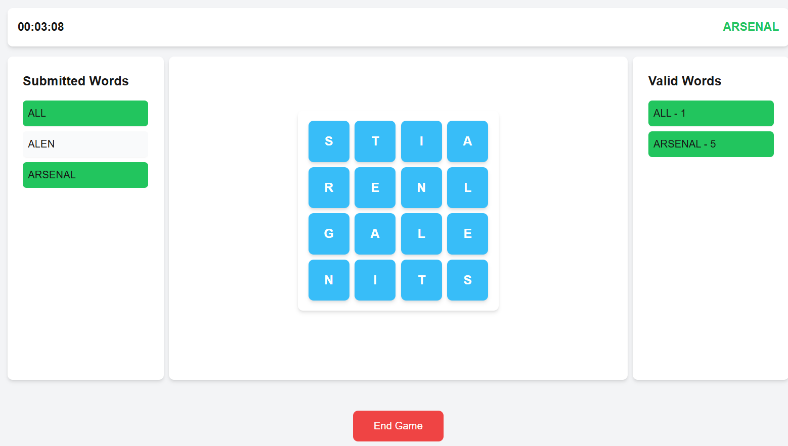
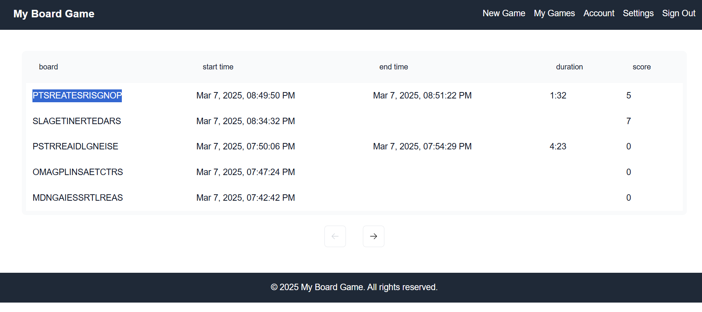

# Boggle Game Application

## Achievements
- **Single-threaded Boggle Board Generation**: Successfully achieved a high-score Boggle board with **4,357 points** using a genetic algorithm in average 20 seconds.
- **Optimized Word Scoring**: Implemented an algorithm that maximizes high-scoring words based on English letter frequency.


## User Interface
The application provides an interactive and intuitive interface for playing the Boggle game. Features include:
- **Dynamic 4×4 Board**: Real-time generation and display of the optimized Boggle board.
- **Word Input & Validation**: Users can enter words, and the system validates them against the dictionary.
- **Scoring System**: Automatic score calculation based on word length and predefined point values.

## Services & Architecture
The application is built with TypeScript and follows a modular architecture. Key services include:

### 1. **Board Generation Service**
   - Implements a **genetic algorithm** to evolve high-scoring Boggle boards.
   - Uses English letter frequency to generate an initial board.
   - Iteratively improves board configurations to maximize word scores.

### 2. **Word Validation Service**
   - Checks if a given word exists in the dictionary in a trie datastructure.
   - Ensures words follow the adjacency rules of the Boggle board.

### 3. **Scoring Service**
   - Calculates scores dynamically based on the Boggle rules.
   - Provides bonus points for longer words and rare letter combinations.

### 4. **Game State Management**
   - Manages user interactions, tracking submitted words and scores.
   - Supports session persistence for continuous gameplay.
   - Base component for multiplayer and multi team boggle game.

## Version 1
The current version is only for testing by single player. It has very simple functionality for starting a new game which since the board generated on run time it takes almost 20 seconds to load the page. This part will be improved in next version. User also can visit the games which has been sreated and played.
The focus of this version was on creating the foundations and base control an services. 

### Play a boggle board

### My games


## Version 1.1
### Features to be Implemented
#### Multiplayer Boggle Board Game
- This version of the multiplayer Boggle game allows players to join a game session and compete against each other. Each team consists of a single player, and all players are opponents.
- The score for each player (single-player team) is calculated as the sum of the scores of all words they find.
- The game panel displays the leaderboard for the current session, showing participating players and their corresponding real-time scores.
#### Player Registration
- To join a new game session, players must be invited by the game organizer. They can enter the session number to register and join the game.
#### Boggle Board Generation Performance
- The performance of Boggle board generation should be significantly improved to provide a smooth user experience without reducing board quality.
- Compiled languages such as Rust should be used for board generation to enhance performance and take advantage of multi-threading.

## Future Enhancements
- **Multiplayer Mode**: Enable real-time competition with multiple players.
- **Performance Optimization**: Improve efficiency of board generation and word validation.

## Setup & Installation
1. **Clone the Repository**
   ```bash
   git clone https://github.com/MeyarAeini/Boggle-Game.git
   cd Boggle-Game
   ```
2. **Install Dependencies**
   ```bash
   npm install
   ```
3. **Run the Application**
   ```bash
    docker-compose up --build
   ```